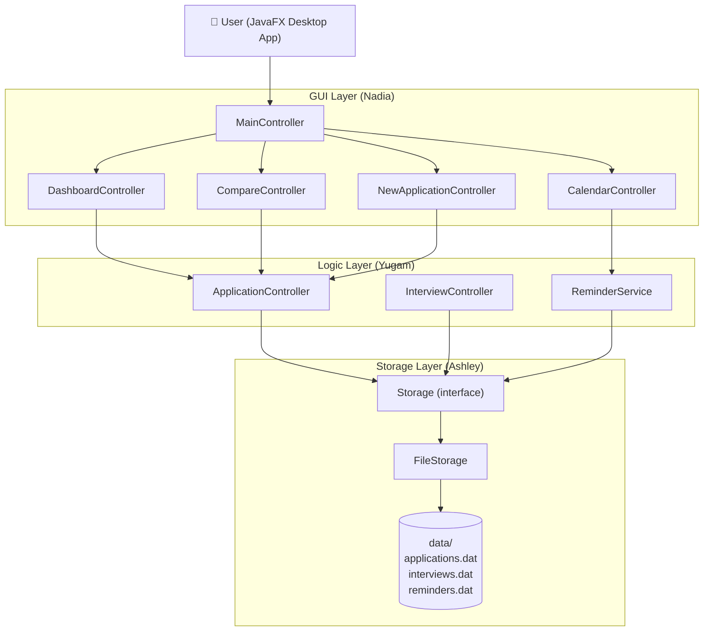
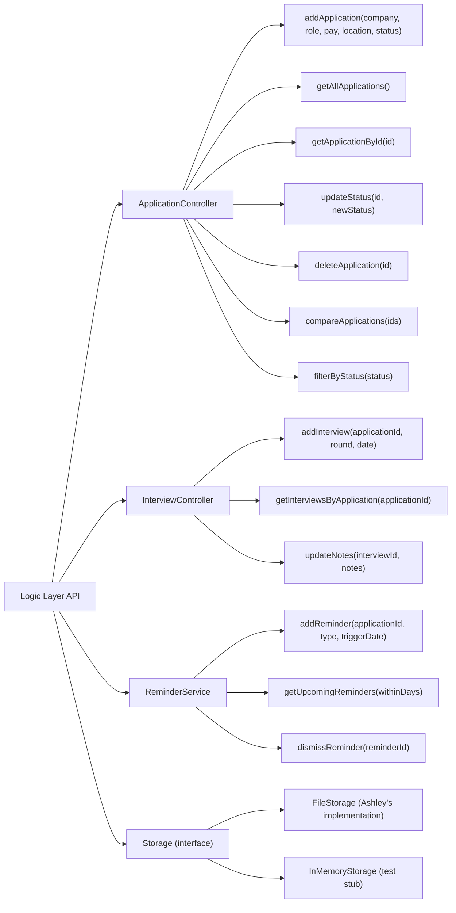
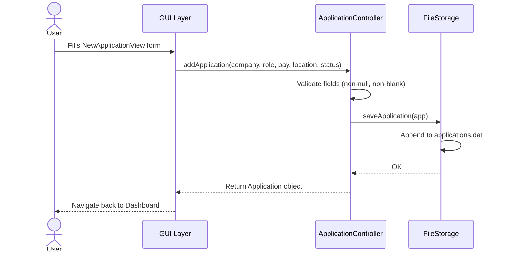
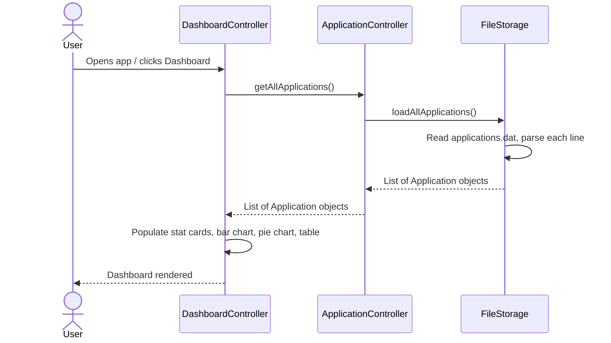
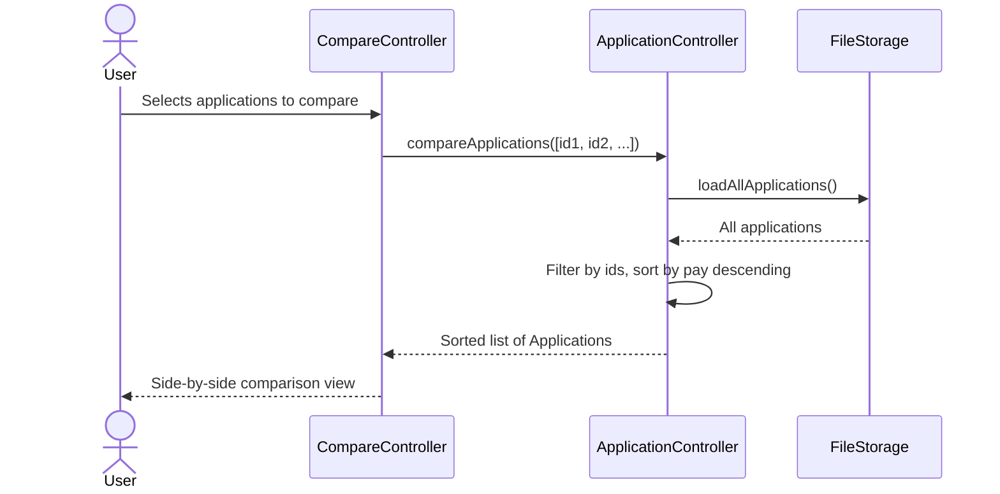
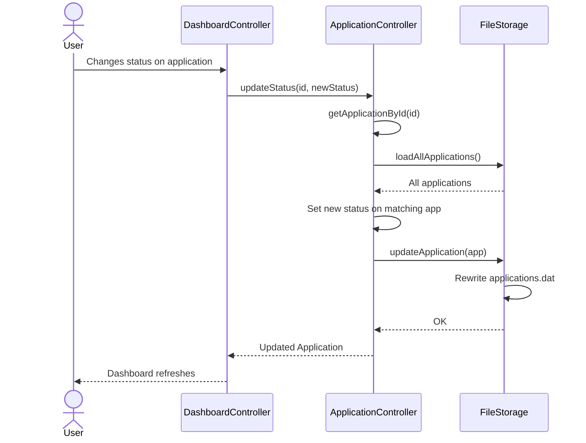
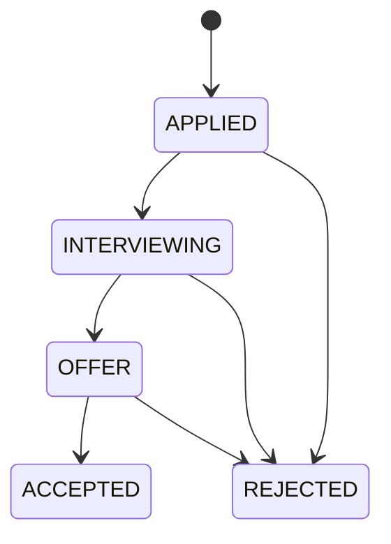

# March Meet — API Documentation

**Version:** 2.0  
**Author:** Yugam  
**Last Updated:** March 2026  
**Stack:** Java 17, JavaFX, Gradle

---

## Table of Contents

1. [Overview](#overview)
2. [System Architecture](#system-architecture)
3. [API Endpoint Map](#api-endpoint-map)
4. [Sequence Diagrams](#sequence-diagrams)
5. [Data Models](#data-models)
6. [Storage Format](#storage-format)
7. [Error Handling](#error-handling)
8. [Status Flow](#status-flow)

---

## Overview

March Meet is a desktop internship application tracker built with JavaFX. It helps students manage applications, interview schedules, deadlines, and offer comparisons from a single dashboard.

The system is divided into three layers:
- **GUI Layer** — JavaFX controllers and FXML views (Nadia)
- **Logic Layer** — Application logic, validation, and business rules (Yugam)
- **Storage Layer** — File-based persistence using plain text `.dat` files (Ashley)

---

## System Architecture



---

## API Endpoint Map

Internal method-level API between layers.



---

## Sequence Diagrams

### 1. Add New Application



### 2. Load Dashboard



### 3. Compare Applications



### 4. Update Application Status



---

## Data Models

### Application

| Field | Type | Description |
|---|---|---|
| `id` | `String` | UUID — unique identifier |
| `companyName` | `String` | Name of the company |
| `roleTitle` | `String` | Job/internship title |
| `pay` | `double` | Monthly salary |
| `location` | `String` | Office location |
| `status` | `ApplicationStatus` | Enum: APPLIED, INTERVIEWING, OFFER, REJECTED, ACCEPTED |
| `dateApplied` | `LocalDate` | Date application was submitted |
| `deadline` | `LocalDate` | Offer acceptance deadline (nullable) |
| `notes` | `String` | Remarks / job scope notes |

### Interview

| Field | Type | Description |
|---|---|---|
| `id` | `String` | UUID — unique identifier |
| `applicationId` | `String` | FK to Application |
| `round` | `int` | Interview round number (1, 2, 3...) |
| `date` | `LocalDateTime` | Scheduled date and time |
| `notes` | `String` | Notes on interviewer, questions asked |

### Reminder

| Field | Type | Description |
|---|---|---|
| `id` | `String` | UUID — unique identifier |
| `applicationId` | `String` | FK to Application |
| `type` | `ReminderType` | Enum: DEADLINE, INTERVIEW, FOLLOWUP |
| `triggerDate` | `LocalDate` | When to alert the user |
| `dismissed` | `boolean` | Whether user has dismissed it |

---

## Storage Format

Ashley's `FileStorage` persists data in plain text `.dat` files in the `data/` directory. Each line is one record, fields separated by `|`. Pipe characters in field values are escaped as `&#124;`.

### applications.dat
```
id|companyName|roleTitle|pay|location|status|dateApplied|deadline|notes
```
Example:
```
abc12345-...|Google|SWE Intern|5000.0|Singapore|APPLIED|2026-03-01|2026-04-01|Great role
```

### interviews.dat
```
id|applicationId|round|date|notes
```
Example:
```
def67890-...|abc12345-...|1|2026-03-15T10:00|Very friendly interviewer
```

### reminders.dat
```
id|applicationId|type|triggerDate|dismissed
```
Example:
```
ghi11111-...|abc12345-...|DEADLINE|2026-04-01|false
```

---

## Error Handling

| Error | Cause | Behaviour |
|---|---|---|
| `IllegalArgumentException` | Null/blank company name or role title | Logic rejects before storage call |
| `IllegalArgumentException` | ID not found in storage | Thrown by `getApplicationById`, `updateNotes` |
| `RuntimeException` | Cannot create data directory | Thrown by `FileStorage.ensureDataDir()` |
| `RuntimeException` | Cannot write to `.dat` file | Thrown by `FileStorage.writeLines()` |
| Corrupt line in `.dat` file | Parse error | Silently skipped, returns null, filtered out |

---

## Status Flow

