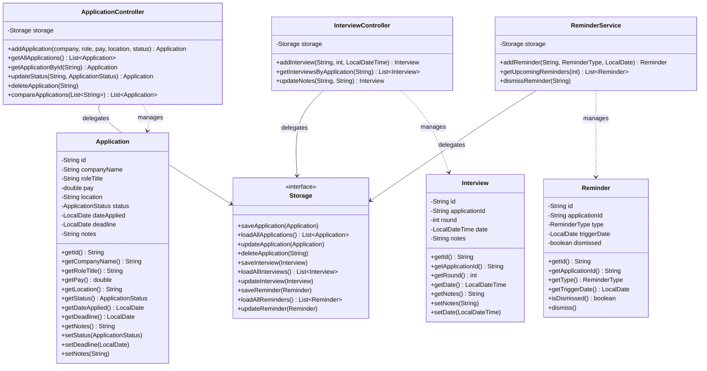
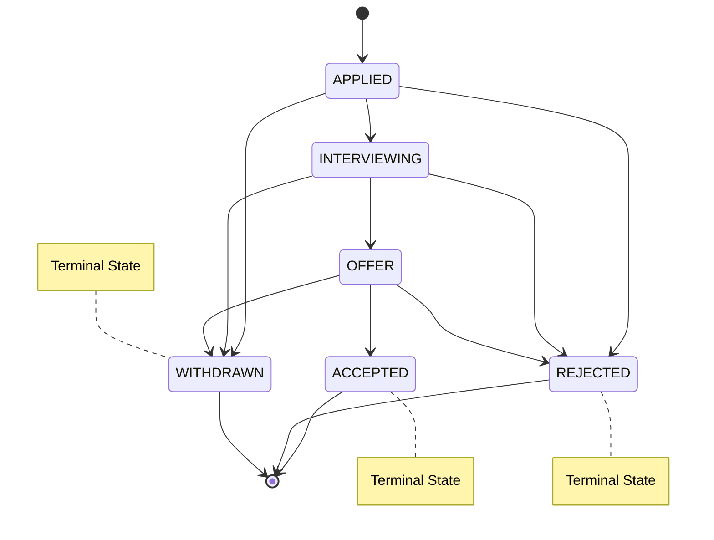
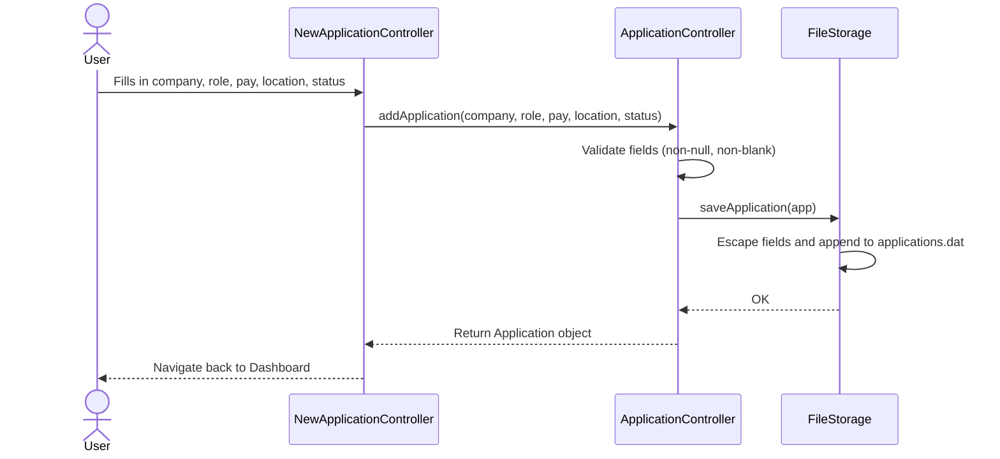
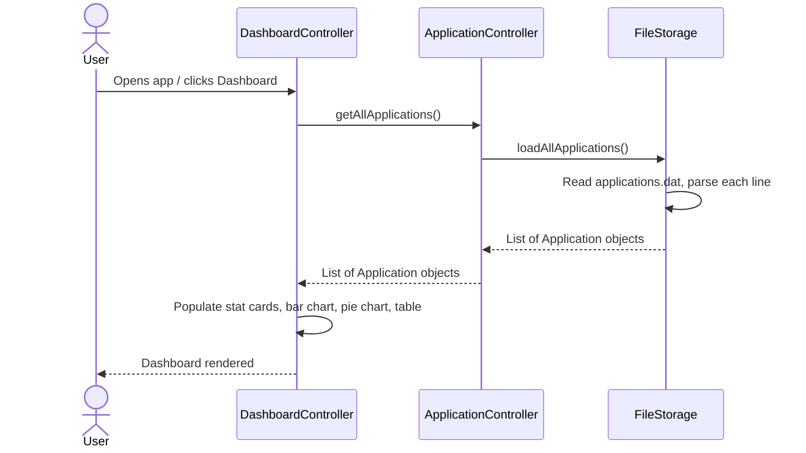
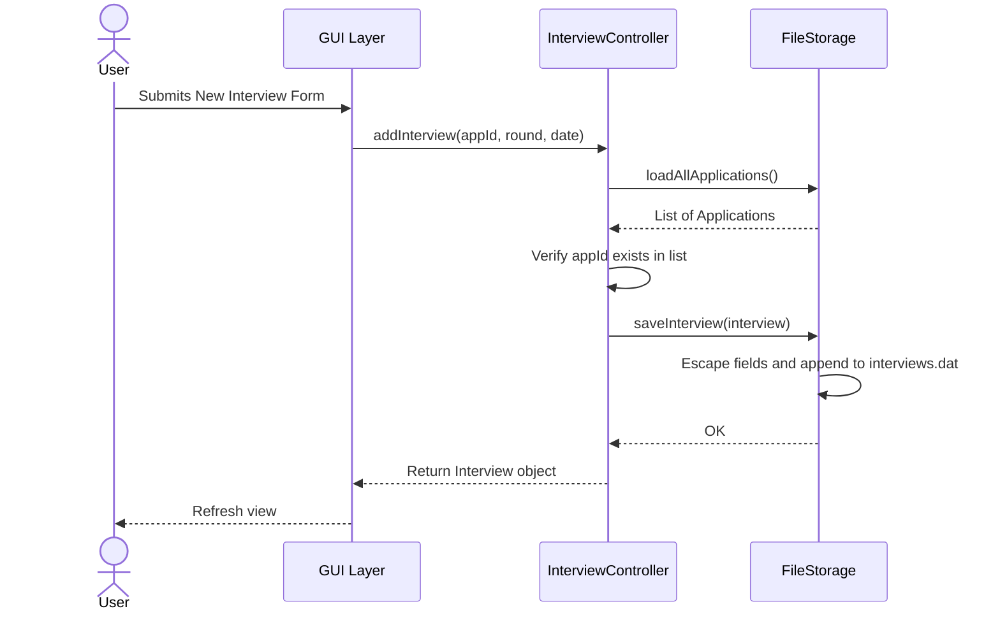
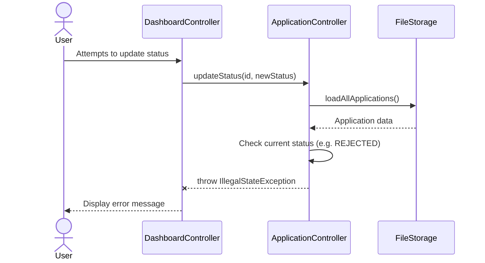
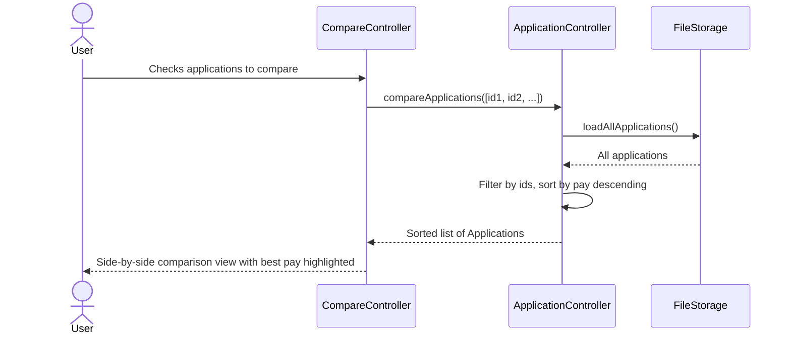
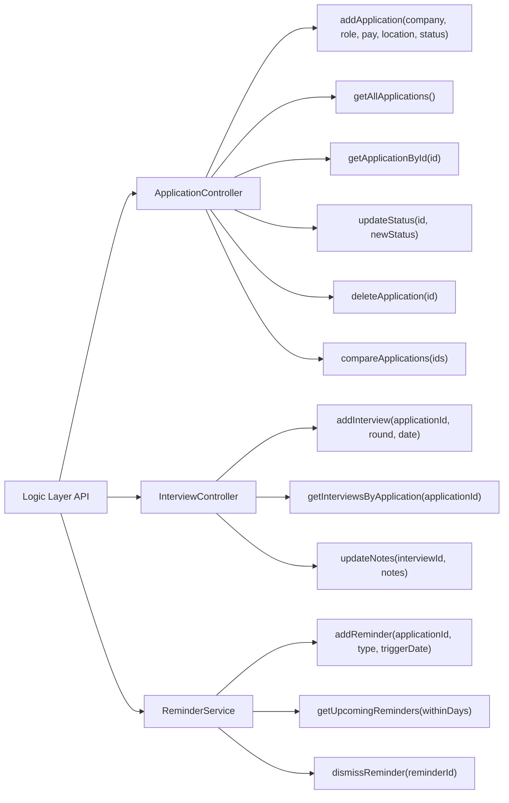

# March Meet — System Architecture & API Documentation

**Version:** 2.1 (V1.5 Release Candidate)
**Author:** Yugam
**Last Updated:** April 12, 2026
**Stack:** Java 17, JavaFX 21, Gradle 9.3

---

## Table of Contents
1. [System Architecture](#1-system-architecture)
2. [Class Diagram](#2-class-diagram)
3. [State Diagram (Status Flow)](#3-state-diagram-status-flow)
4. [Sequence Diagrams](#4-sequence-diagrams)
5. [API Endpoint Map](#5-api-endpoint-map)
6. [Storage Format & Security](#6-storage-format--security)
7. [Error & Exception Handling](#7-error--exception-handling)

---

## 1. System Architecture

The application strictly adheres to a 3-Tier Layered Architecture to ensure separation of concerns. The GUI layer strictly consumes the Logic layer's API and never interacts directly with the Storage layer.

```mermaid
graph TD
    User["👤 User (JavaFX Desktop App)"]

    subgraph GUI ["GUI Layer (Nadia)"]
        Main["MainController"]
        Dashboard["DashboardController"]
        Calendar["CalendarController"]
        Compare["CompareController"]
        NewApp["NewApplicationController"]
    end

    subgraph Logic ["Logic Layer (Yugam)"]
        AppController["ApplicationController"]
        InterviewController["InterviewController"]
        ReminderService["ReminderService"]
    end

    subgraph Storage ["Storage Layer (Ashley)"]
        Interface["Storage <<interface>>"]
        FileStorage["FileStorage"]
        InMemory["InMemoryStorage <<test stub>>"]
        DataFiles[("data/\napplications.dat\ninterviews.dat\nreminders.dat")]
    end

    User --> Main
    Main --> Dashboard
    Main --> Calendar
    Main --> Compare
    Main --> NewApp

    Dashboard --> AppController
    Compare --> AppController
    Calendar --> ReminderService
    NewApp --> AppController

    AppController --> Interface
    InterviewController --> Interface
    ReminderService --> Interface

    Interface <|.. FileStorage
    Interface <|.. InMemory
    FileStorage --> DataFiles
```

---

## 2. Class Diagram

This diagram maps the core domain models and their relationships with the Logic layer controllers and the Storage interface.



---

## 3. State Diagram (Status Flow)

This state machine represents the valid application status transitions enforced by the `ApplicationController`. `REJECTED`, `ACCEPTED`, and `WITHDRAWN` are strictly enforced terminal states — no further transitions are permitted once reached.



---

## 4. Sequence Diagrams

### 4.1 Add New Application



### 4.2 Load Dashboard



### 4.3 Add Interview with Referential Integrity Check

When a new interview is added, the Logic layer verifies the parent application exists before saving, preventing orphaned records.



### 4.4 Invalid Status Transition

The Logic layer blocks invalid status updates before they reach storage, throwing a typed exception for the GUI to handle.



### 4.5 Compare Applications



---

## 5. API Endpoint Map

Internal method-level API exposed by the Logic layer for the GUI layer to consume.



### `ApplicationController`
- `Application addApplication(company, role, pay, location, status)` — throws `IllegalArgumentException` on blank/null company name or role title
- `List<Application> getAllApplications()`
- `Application getApplicationById(id)` — throws `IllegalArgumentException` if not found
- `Application updateStatus(id, newStatus)` — throws `IllegalStateException` if current status is `REJECTED` or `ACCEPTED` (terminal), or if jumping from `APPLIED` directly to `OFFER`
- `void deleteApplication(id)`
- `List<Application> compareApplications(List<String> ids)` — sorted by pay descending

### `InterviewController`
- `Interview addInterview(applicationId, round, date)` — throws `IllegalArgumentException` if parent application does not exist (referential integrity)
- `List<Interview> getInterviewsByApplication(applicationId)` — sorted by round ascending
- `Interview updateNotes(interviewId, notes)` — throws `IllegalArgumentException` if interview not found

### `ReminderService`
- `Reminder addReminder(applicationId, type, triggerDate)` — throws `IllegalArgumentException` if parent application does not exist (referential integrity)
- `List<Reminder> getUpcomingReminders(withinDays)` — filters dismissed and expired automatically, sorted by date ascending
- `void dismissReminder(reminderId)` — silently no-ops if ID not found

---

## 6. Storage Format & Security

Persistence is handled via flat-file storage using pipe delimiters (`|`). All user input is sanitized before writing — any `|` characters are escaped to `&#124;` to prevent data corruption, and unescaped on load. Corrupted lines are silently skipped and logged without crashing the application.

### `applications.dat`
```
id|companyName|roleTitle|pay|location|status|dateApplied|deadline|notes
```
Example:
```
uuid-1234|Google|SWE Intern|5000.0|Singapore|APPLIED|2026-03-01||Loves Python &#124; C++
```

### `interviews.dat`
```
id|applicationId|round|date|notes
```
Example:
```
uuid-5678|uuid-1234|1|2026-03-15T10:00|Very friendly interviewer
```

### `reminders.dat`
```
id|applicationId|type|triggerDate|dismissed
```
Example:
```
uuid-9999|uuid-1234|DEADLINE|2026-04-01|false
```

### Escaping Rules

| Character | Written As | Restored On Load |
|:---|:---|:---|
| `\|` (pipe) | `&#124;` (HTML entity) | `&#124;` → `\|` via `unescape()` |
| `null` string | `""` (empty string) | `escape(null)` returns `""` |

- **Escape** is applied to all user-editable string fields: `id`, `companyName`, `roleTitle`, `location`, `notes`, `applicationId`, and interview `notes`.
- **Not escaped**: numeric fields (`pay`, `round`), enum fields (`status`, `type`), date fields (`dateApplied`, `deadline`, `triggerDate`, `date`), and boolean fields (`dismissed`) — these are serialized via `.toString()` / `.name()` directly.

### Parsing Rules & Edge Cases

| Scenario | Behaviour |
|:---|:---|
| File does not exist | `readLines()` returns an empty list — treated as no data yet |
| File exists but is empty | Returns an empty list — no records |
| Line is `null` or blank | Skipped (`parseXxx()` returns `null`, filtered out) |
| Line has fewer fields than expected | Skipped (field count check: `< 9` for applications, `< 5` for interviews/reminders) |
| `pay` is not a valid double | `NumberFormatException` caught → line skipped, logged at `WARNING` |
| `status` is not a valid `ApplicationStatus` enum | `IllegalArgumentException` caught → line skipped, logged at `WARNING` |
| `dateApplied` / `deadline` / `date` is malformed | `DateTimeParseException` caught → line skipped, logged at `WARNING` |
| `deadline` field is empty string | Parsed as `null` (`LocalDate`) — deadline is optional |
| Duplicate application ID on save | `saveApplication()` checks for existing ID and skips the duplicate |
| Duplicate interview/reminder ID on save | **Not checked** — callers are responsible for not saving the same object twice |
| IOException on read | Logged at `SEVERE`, throws `RuntimeException` — GUI catches and shows error dialog |
| IOException on write | Logged at `SEVERE`, throws `RuntimeException` — GUI catches and shows error dialog |
| Data directory does not exist | Created automatically by `ensureDataDir()` on first write |
| Data directory cannot be created | Throws `RuntimeException` — GUI catches and shows error dialog |

### ID Generation

All entity IDs (`Application`, `Interview`, `Reminder`) are generated via `UUID.randomUUID().toString()` at construction time. IDs are immutable (`final`) after creation. The standard constructor (used for new records) generates the ID; the full constructor (used by `FileStorage` when loading from disk) accepts the existing ID.

### File I/O Strategy

- **Parsing**: `split("\\|", -1)` is used to split lines, preserving trailing empty fields.
- **Writing**: The entire file is rewritten on every save/update/delete operation (`Files.write(path, lines)`). This is a full-rewrite strategy, not append-only.
- **Concurrency**: No file locking is implemented — the app assumes single-user, single-instance access.

---

## 7. Error & Exception Handling

| Exception | Source Layer | Trigger Condition |
|:---|:---|:---|
| `IllegalArgumentException` | Logic | Null/blank Company Name or Role Title on `addApplication` |
| `IllegalArgumentException` | Logic | ID not found in `getApplicationById` or `updateNotes` |
| `IllegalArgumentException` | Logic | Parent application not found when calling `addInterview` or `addReminder` (referential integrity) |
| `IllegalStateException` | Logic | Status transition violation — modifying a `REJECTED` or `ACCEPTED` application, or jumping from `APPLIED` to `OFFER` |
| `RuntimeException` | Storage | Directory creation fails or I/O permissions block file access |
| `RuntimeException` | Storage | File read or write failure — logged via `java.util.logging.Logger` |
| *(Handled internally)* | Storage | Corrupt line in `.dat` file — logged at `WARNING` level and skipped, app continues running |