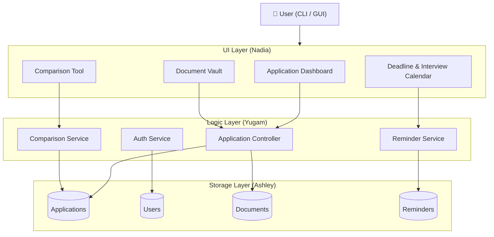
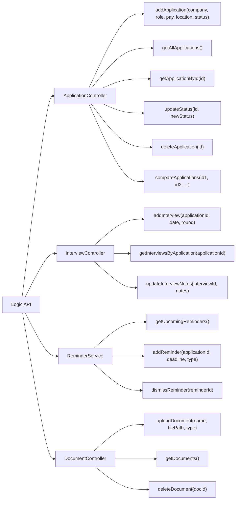
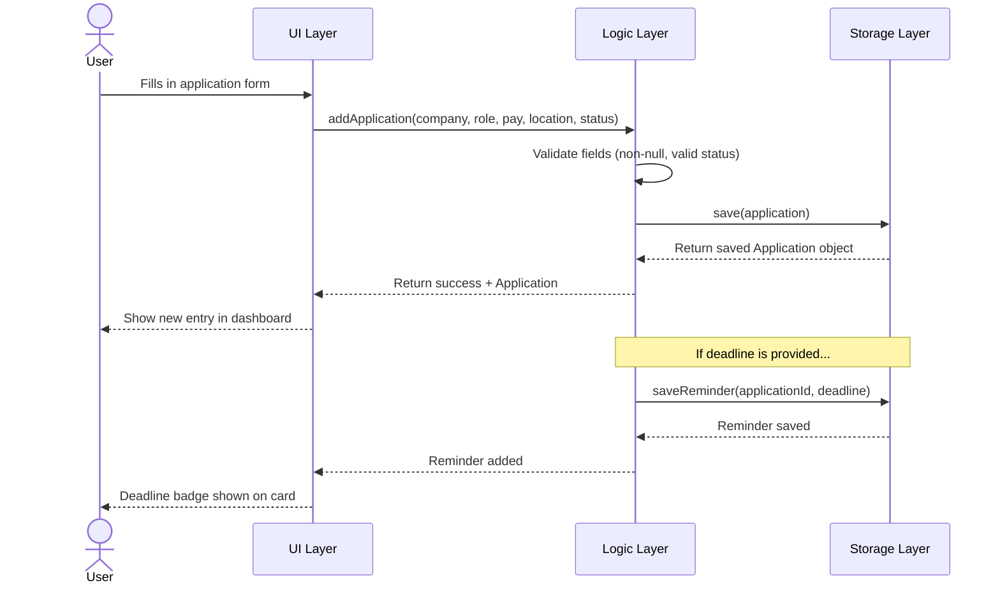
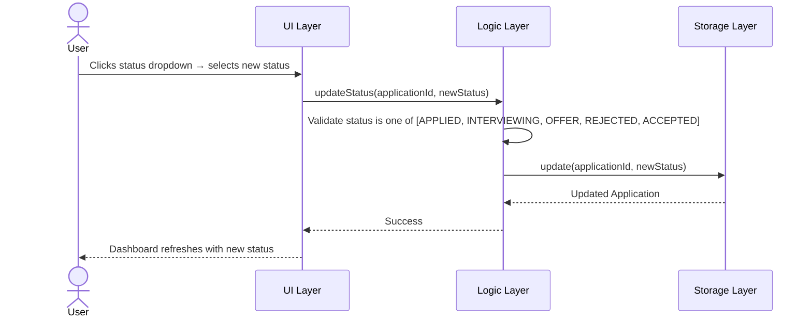
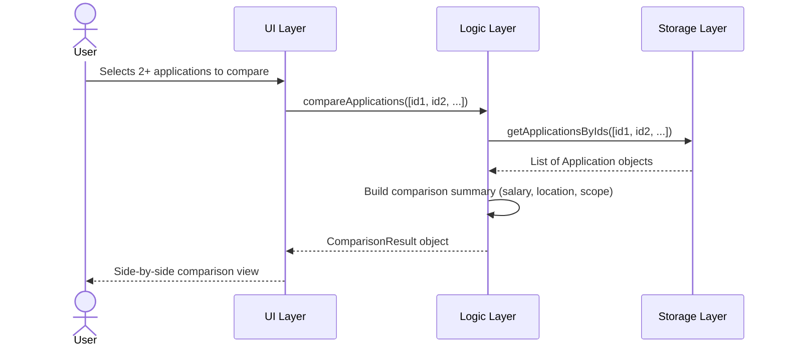
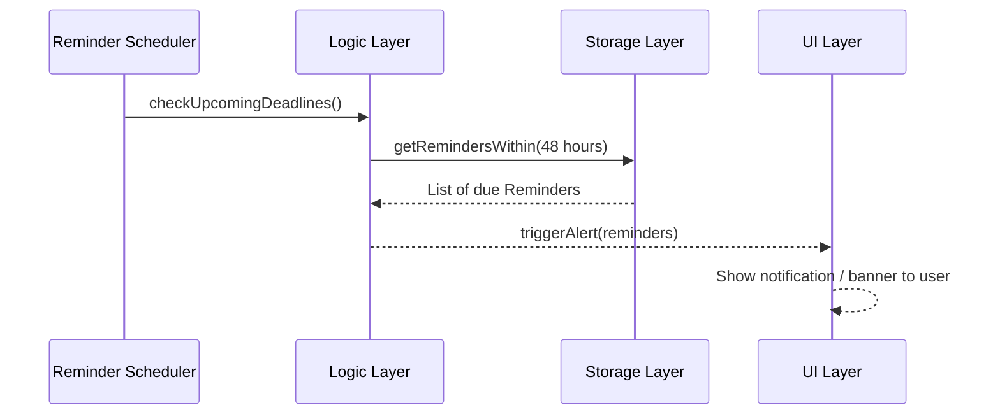
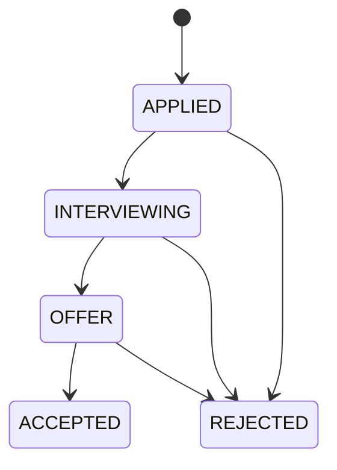

# March Meet — API Documentation

**Version:** 1.0  
**Author:** Yugam  
**Last Updated:** March 2026  
**Stack:** Java

---

## Table of Contents

1. [Overview](#overview)
2. [System Architecture](#system-architecture)
3. [API Endpoint Map](#api-endpoint-map)
4. [Sequence Diagrams](#sequence-diagrams)
5. [Data Models](#data-models)
6. [Error Handling](#error-handling)

---

## Overview

March Meet is an internship application tracker that helps students manage their internship applications, interview schedules, deadlines, and offer comparisons from a single dashboard.

The system is divided into three layers:
- **UI Layer** — handles all user interactions (Nadia)
- **Logic Layer** — processes commands, validates input, and manages application state (Yugam)
- **Storage Layer** — persists data to disk (Ashley)

The Logic Layer acts as the bridge between UI and Storage. It exposes a clean internal API that the UI calls, and it delegates all data persistence to the Storage layer.

---

## System Architecture

---

## API Endpoint Map

These represent the internal method calls between layers (not HTTP endpoints, since this is a Java desktop app).

---

## Sequence Diagrams

### 1. Add New Application

### 2. Update Application Status

### 3. Compare Applications

### 4. Reminder Fires (Deadline Alert)

---

## Data Models

### Application

| Field | Type | Description |
|---|---|---|
| `id` | `String` | Unique identifier (UUID) |
| `companyName` | `String` | Name of the company |
| `roleTitle` | `String` | Job/internship title |
| `pay` | `double` | Monthly salary |
| `location` | `String` | Office location |
| `status` | `ApplicationStatus` | Enum: APPLIED, INTERVIEWING, OFFER, REJECTED, ACCEPTED |
| `dateApplied` | `LocalDate` | Date application was submitted |
| `deadline` | `LocalDate` | Offer acceptance deadline (nullable) |
| `notes` | `String` | General remarks / job scope notes |

### Interview

| Field | Type | Description |
|---|---|---|
| `id` | `String` | Unique identifier |
| `applicationId` | `String` | FK to Application |
| `round` | `int` | Interview round number (1, 2, 3...) |
| `date` | `LocalDateTime` | Scheduled date and time |
| `notes` | `String` | Notes on interviewer, questions asked |

### Reminder

| Field | Type | Description |
|---|---|---|
| `id` | `String` | Unique identifier |
| `applicationId` | `String` | FK to Application |
| `type` | `ReminderType` | Enum: DEADLINE, INTERVIEW, FOLLOWUP |
| `triggerDate` | `LocalDate` | When to alert the user |
| `dismissed` | `boolean` | Whether user has dismissed it |

### Document

| Field | Type | Description |
|---|---|---|
| `id` | `String` | Unique identifier |
| `name` | `String` | Display name (e.g. "Resume_v3") |
| `filePath` | `String` | Path to file on disk |
| `type` | `DocumentType` | Enum: RESUME, TRANSCRIPT, ID, OTHER |

---

## Error Handling

| Error | Cause | Behaviour |
|---|---|---|
| `InvalidStatusException` | Status value not in enum | Logic layer rejects, UI shows error message |
| `ApplicationNotFoundException` | ID doesn't exist in storage | Logic throws, UI shows "Application not found" |
| `MissingFieldException` | Required field is null/empty | Validation fails before storage call |
| `StorageException` | File read/write failure | Logic catches, returns failure result to UI |

---

## Status Flow

